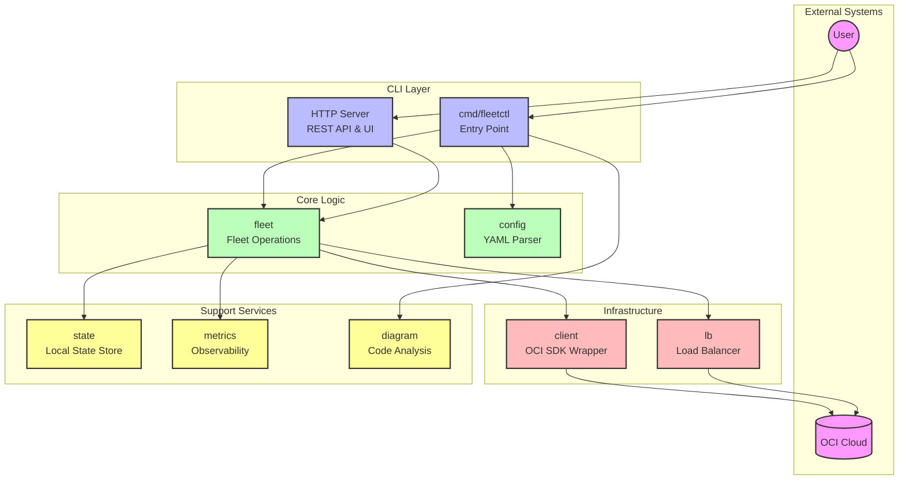

```mermaid
flowchart TB
    %% FleetCTL Architecture Diagram
    %% Generated by fleetctl --diagram architecture

    subgraph EXTERNAL["External Systems"]
        OCI[("OCI Cloud")]
        USER(("User"))
    end

    subgraph CLI["CLI Layer"]
        MAIN["cmd/fleetctl<br/>Entry Point"]
        HTTP["HTTP Server<br/>REST API & UI"]
    end

    subgraph CORE["Core Logic"]
        FLEET["fleet<br/>Fleet Operations"]
        CONFIG["config<br/>YAML Parser"]
    end

    subgraph INFRA["Infrastructure"]
        CLIENT["client<br/>OCI SDK Wrapper"]
        LB["lb<br/>Load Balancer"]
    end

    subgraph SUPPORT["Support Services"]
        STATE["state<br/>Local State Store"]
        METRICS["metrics<br/>Observability"]
        DIAGRAM["diagram<br/>Code Analysis"]
    end

    %% Relationships
    USER --> MAIN
    USER --> HTTP
    MAIN --> FLEET
    HTTP --> FLEET
    MAIN --> CONFIG
    FLEET --> CLIENT
    FLEET --> STATE
    FLEET --> LB
    FLEET --> METRICS
    CLIENT --> OCI
    LB --> OCI
    MAIN --> DIAGRAM

    %% Styling
    classDef external fill:#f9f,stroke:#333,stroke-width:2px
    classDef cli fill:#bbf,stroke:#333,stroke-width:2px
    classDef core fill:#bfb,stroke:#333,stroke-width:2px
    classDef infra fill:#fbb,stroke:#333,stroke-width:2px
    classDef support fill:#ff9,stroke:#333,stroke-width:2px
    class OCI,USER external
    class MAIN,HTTP cli
    class FLEET,CONFIG core
    class CLIENT,LB infra
    class STATE,METRICS,DIAGRAM support
```
