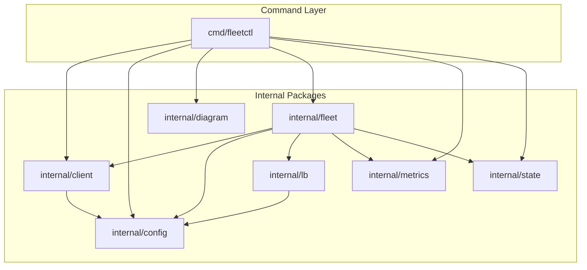

```mermaid
graph TD
    %% Package Dependency Diagram
    %% Generated by fleetctl --diagram packages

    subgraph CMD["Command Layer"]
        pkg0["cmd/fleetctl"]
    end

    subgraph INTERNAL["Internal Packages"]
        pkg1["internal/client"]
        pkg2["internal/config"]
        pkg3["internal/diagram"]
        pkg4["internal/fleet"]
        pkg5["internal/lb"]
        pkg6["internal/metrics"]
        pkg7["internal/state"]
    end

    %% Dependencies
    pkg0 --> pkg1
    pkg0 --> pkg2
    pkg0 --> pkg3
    pkg0 --> pkg4
    pkg0 --> pkg6
    pkg0 --> pkg7
    pkg1 --> pkg2
    pkg4 --> pkg1
    pkg4 --> pkg2
    pkg4 --> pkg5
    pkg4 --> pkg6
    pkg4 --> pkg7
    pkg5 --> pkg2
```
